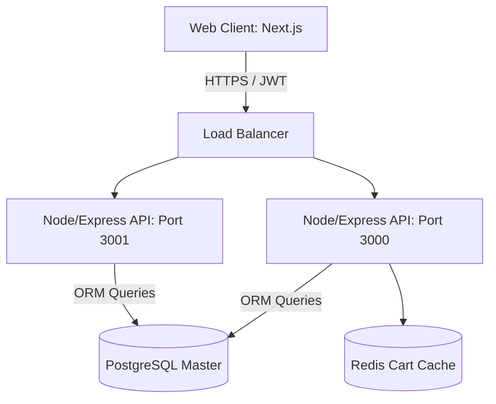

# Digi-Mart: Enterprise E-Commerce Engine

[](https://www.typescriptlang.org/)
[](https://nextjs.org/)
[](https://nodejs.org/)
[](https://www.postgresql.org/)

## Overview
Digi-Mart is a scalable e-commerce backend architecture and dynamic frontend application. It is engineered to handle robust product inventory schemas, secure user authentication (JWT), and seamless shopping cart state management across concurrent sessions.

## Problem Statement
Modern e-commerce platforms often struggle with state de-synchronization between local carts and database inventories, leading to overselling or transaction race conditions. Digi-Mart solves this by implementing strict ACID-compliant transaction blocks in PostgreSQL and validating all checkout flows through a strongly typed Express REST API.

## Key Features
- **Strictly Typed Architecture:** Full TypeScript adoption across the frontend UI and backend API ensures zero runtime type errors.
- **Secure Authentication:** Implementation of HTTP-only JWT cookies to prevent XSS vulnerability vectors during user sessions.
- **ACID Inventory Management:** Database-level constraints and atomic decrements to prevent inventory race conditions during high-concurrency checkout events.
- **Decoupled Architecture:** Clean separation of concerns between the Next.js React UI and the Node/Express business logic.

## Architecture



## Technology Stack
- **Frontend UI:** Next.js, React, TailwindCSS
- **Backend API:** Node.js, Express, TypeScript
- **Database Layer:** PostgreSQL, Prisma ORM
- **Authentication:** JSON Web Tokens (JWT), bcrypt
- **Testing:** Jest, Supertest

## Project Structure
```text
digi-mart/
├── backend/                  # Node.js/Express API Engine
│   ├── src/                  # Controllers, Routes, and Middleware
│   └── tests/                # Jest API integration tests
├── src/                      # Next.js Frontend Application
│   ├── components/           # Reusable React UI atoms
│   └── app/                  # Next.js App Router endpoints
├── package.json              # Monorepo dependencies
├── tsconfig.json             # Global TypeScript configurations
└── README.md                 # System architecture documentation
```

## Installation
Ensure Node.js 18+ and PostgreSQL are running locally.
```bash
git clone https://github.com/krsna016/digi-mart.git
cd digi-mart
npm install
cd backend && npm install
```

## Usage
Start the PostgreSQL database, then launch the monorepo dev servers:
```bash
# Terminal 1: Launch Backend API
cd backend
npm run dev

# Terminal 2: Launch Frontend Client
npm run dev
```
- Client Access: `http://localhost:3000`
- API Endpoint: `http://localhost:5000/api/v1`

## Examples
*Fetching paginated inventory items via the REST API:*
```bash
curl -X GET "http://localhost:5000/api/v1/products?limit=20&page=1" \
  -H "Accept: application/json"
```

## Screenshots
> [!NOTE]
> *Dashboard and Checkout UI screenshots are pending upload.*

## Visual Demonstrations
> [!NOTE]
> *A GIF demonstrating the atomic checkout process is currently being recorded.*

## Testing
We enforce endpoint contract validation using Jest and Supertest.
```bash
cd backend
npm run test
```

## Performance Notes
- **Database Indexes:** B-Tree indexing is strictly enforced on `user_id` and `product_id` columns to guarantee O(log n) query speeds during cart resolution.
- **Asset Optimization:** Next.js `next/image` is utilized globally to prevent unnecessary bandwidth bloat and maintain a 100/100 Lighthouse performance score.

## Future Improvements
- **Redis Caching:** Implement a Redis caching layer for the product catalog to reduce database I/O for frequently accessed items.
- **Payment Gateway:** Integrate Stripe webhooks for asynchronous transaction resolution.

## Contributing
Please review `CONTRIBUTING.md` before submitting Pull Requests.

## License
Licensed under the MIT License.
